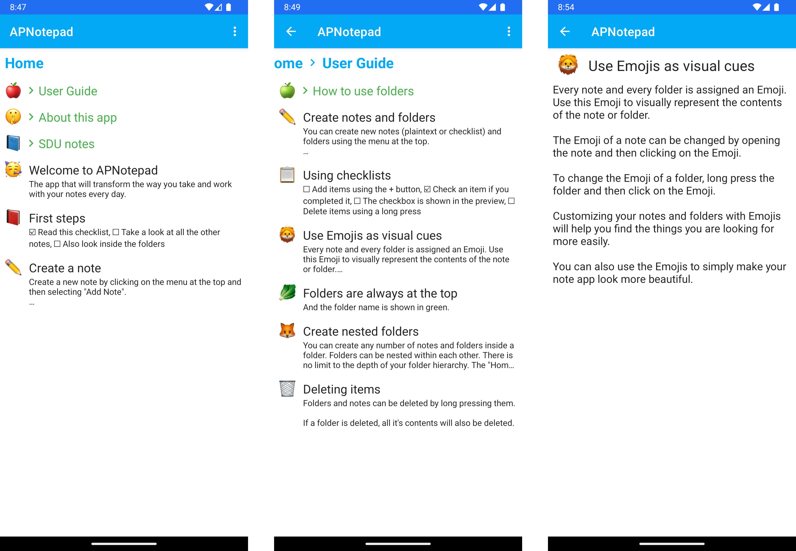
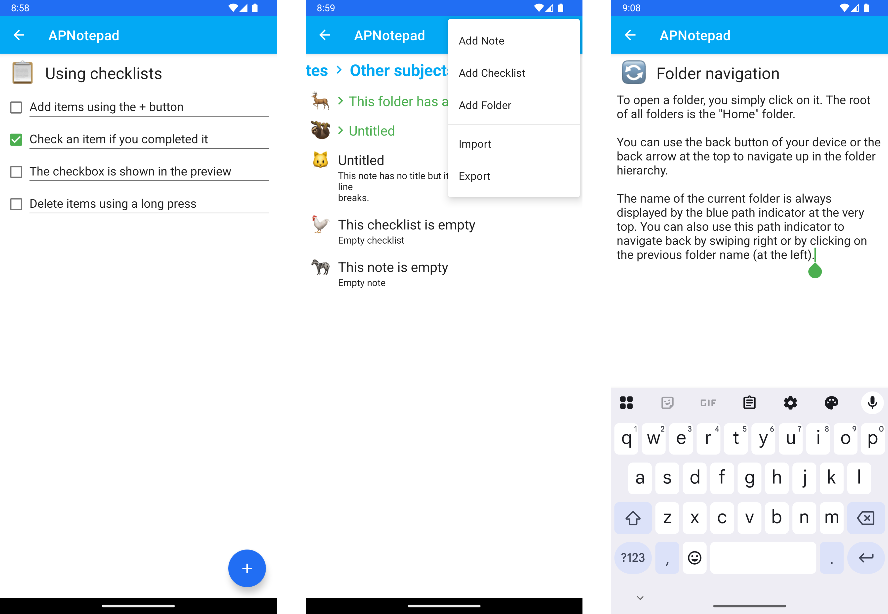
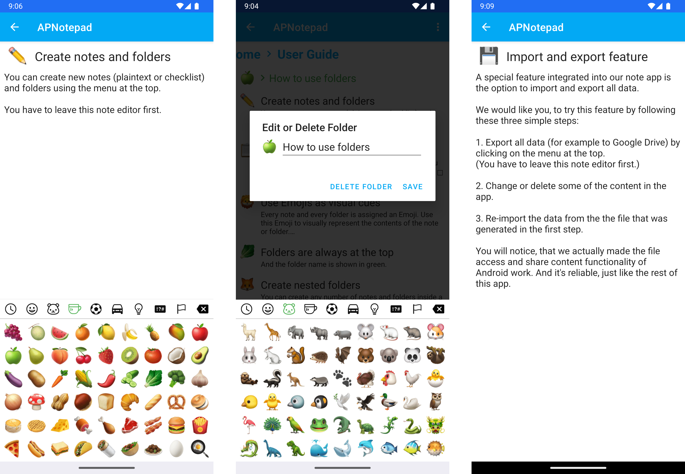

# All Purpose Notepad (APNotepad)

| Author | Institution | Date |
|:---|:---|:---|
| Etienne Gubler | University of Southern Denmark | Mar. 2021 - May 2021 |

## Description

Note-taking app for Android with customizable **Emoji icons for notes** and folders. Supports **plain text notes and checklists** that can be organized in a **hierarchical folder structure**. All data can be **exported to a JSON file** to create a backup that can then be re-imported on a new device. The app is developed using Kotlin.

## Project Structure

- Project report: [APNotepad_Project-Report.pdf](./docs/report/APNotepad_Project-Report.pdf)
- Android Studio project root: [android/APNotepad/](./android/APNotepad/)
- Main srouce files: [android/APNotepad/app/src/main/java/dk/sdu/ap/apnotepad/](./android/APNotepad/app/src/main/java/dk/sdu/ap/apnotepad/)

## How to Run

1. Open the APNotepad project in Android Studio
2. Run Gradle sync
3. Run 'app' (default run configuration)

## Screenshots

